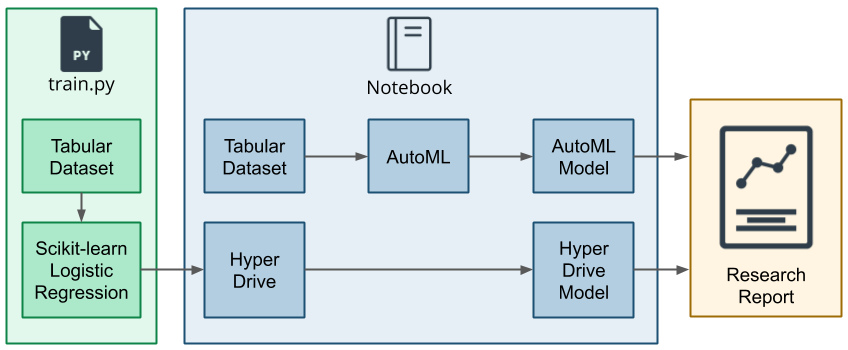

# Optimizing an ML Pipeline in Azure

## Overview
This project is part of the Udacity Azure ML Nanodegree.
In this project, we build and optimize an Azure ML pipeline using the Python SDK and a provided Scikit-learn model.
This model is then compared to an Azure AutoML run.

## Summary

The data we will work with is related with direct marketing campaigns of a Portuguese banking institution.

The marketing campaigns were based on phone calls.
Thereby each customer was asked to subscribe the product (bank term deposit). 
Thus, the resulting record contains the information whether the customer has purchased the product and what characteristics (f.e. age, job, education, default and balance) this customer had.

So the goal of this project is to use these characteristics to predict whether someone will complete a bank term deposit,
in order to possibly optimize future campaigns.
In doing so, we take two different strategies: One is a logistic regression whose hyperparameters we tune and the second is an Azure AutoML approach.

With this procedure we obtained a Voting-Ensemble by the AutoML approach. This model achieved the best validation accuracy of 91.70%.

## Scikit-learn Pipeline

First, we obtain the dataset from the specified URL using the TabularDataFactory class. Next, we perform data cleaning via the 'clean_data' method,
which involves some data preprocessing. The dataset is then split into 90% for training and 10% for testing.

We utilize sklearn's LogisticRegression Class to establish and fit the model. We then create a SKLearn estimator to be passed later to the HyperDrive Config script.
Additionally, we define a parameter sampler to tune the hyperparameters, specifically the inverse regularization parameter (C) and maximum number of iterations (max_iter).
Thereby random parameter sampling was used, because it is an efficient, exploratory, and parallelizable method for hyperparameter tuning,
which can potentially find better hyperparameters than other search methods.
It is also robust to noise and other sources of variability in the training process.
Additionally, a bandit policy was applied, since it is a popular early termination policy used in hyperparameter tuning 
that aims to save computational resources by terminating poorly performing runs early.

With the estimator, parameter sampler, and an early termination policy, we create a HyperDrive Config, which is subsequently submitted as an experiment.
Upon completion of the run, we determine that the best model archives a validation accuracy of 90.34%.

## AutoML

The best model generated by AutoML is a Voting-Ensemble consisting of the following enselble models.
Each of these comprise a scaler and a subsequent model (both from Sci-kit learn).
The weights in the second column indicate how much the prediction of each of these individual ensembles went into the overall prediction:

| Model  | Ensemble weight |
| ------------- | ------------- |
| StandardScalerWrapper + XGBoostClassifier  | 11.11% |
| StandardScalerWrapper + LogisticRegression  | 11.11%  |
| StandardScalerWrapper + XGBoostClassifier  | 22.22%  |
| StandardScalerWrapper + XGBoostClassifier  | 11.11%  |
| SparseNormalizer + XGBoostClassifier  | 33.33%  |
| MaxAbsScaler + LightGMB  | 11.11%  |

## Pipeline comparison

The Hyperparamter Tuning of the Logistic Regression resulted in a validation accuracy of 90.34% whereas the Voting-Ensemble, obtained by the 
AutoML approach scored a validation accuracy of 91.70%: 

| Model  | Accuracy|
| ------------- | ------------- |
| Logistic Regression  | 90.34%  |
| Voting-Ensemble  | 91.70%  |

Using the AutoML approach, we were able to achieve better results because it trains and evaluates many different models and then selects the model that best genalizes on the data. 
The voting ensemble also has significantly more parameters than the logistic regression and can therefore generally better capture the relationships between the features and the output variable.

Another major advantage of the AutoML approach is that it performs several preprocessing steps before training.
These include checking for class imbalance, value imputation of missing values, a check of the cardinality of the features and various types of scaling.

## Future work

Since the dataset concerned is highly imbalanced, we can use other metrics to measure the performance of our models, f.e. Weighted-AUC, F1-Score.
If the models do not provide a satisfactory Weighted-AUC or F1 score, one could look at methods to avoid class imbalance f.e. (Undersamling, Oversamling and SMOTE). 

Another approach would be to tune the hyperparameters of the Voting-Ensemble model resulting from the AutoMl approach. 
Among them are the list of estimators, the voting (e.g. hard or soft) and the weights of the occurences of predicted class labels or class probabilities before averaging.

## References 
- [ScriptRunConfig Class](https://docs.microsoft.com/en-us/python/api/azureml-core/azureml.core.scriptrunconfig?view=azure-ml-py)
- [Configure and submit training runs](https://docs.microsoft.com/en-us/azure/machine-learning/how-to-set-up-training-targets)
- [HyperDriveConfig Class](https://docs.microsoft.com/en-us/python/api/azureml-train-core/azureml.train.hyperdrive.hyperdriveconfig?view=azure-ml-py)
- [How to tune hyperparamters](https://docs.microsoft.com/en-us/azure/machine-learning/how-to-tune-hyperparameters)
